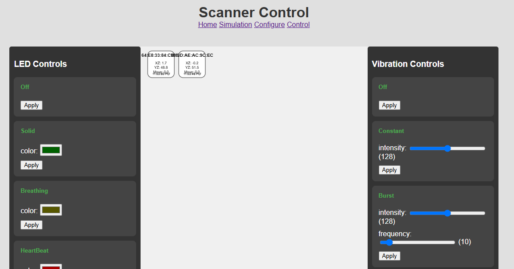

# Control Page Manual

This guide explains how to use the web-based Control Page to monitor and configure the ESP32 scanners in real-time.

## Overview

The Control Page provides a centralized interface for interacting with all active scanner devices. It is divided into two main sections:

1.  **Scanner Grid (Left):** A visual representation of all scanners that have connected to the server in the last 5 minutes.
2.  **Control Panels (Right):** A set of dynamic controls for configuring the LED and vibration behaviors of the selected scanners.

## 1. Monitoring Scanners

The scanner grid displays a box for each active scanner. Each box shows:

*   **Scanner Name:** The unique identifier for the device (e.g., `Scanner-84:CB:84`).
*   **Movement Data:** Real-time data from the onboard accelerometer, including angles and total movement since the last update.
*   **Last Seen Timestamp:** The local time of the last message received from the scanner.

The grid automatically refreshes every 5 seconds to show the latest data and include any new scanners that have come online.

## 2. Selecting Scanners

To configure a device, you must first select it.

*   **Single Selection:**
    1.  Click and drag to draw a selection box around the scanner you want to select.
    2.  A selected scanner will be highlighted with a green border.

    **Multiple Selection:**
    1.  Hold down the **`Shift`** key.
    2.  While holding `Shift`, click and drag a selection box. You can repeat this to add multiple, non-adjacent scanners to your selection. Any scanner that falls within the selection rectangle will be added to the current group of selected scanners.

|  |
|-|
|Control panel|

## 3. Configuring Behaviors

Once you have one or more scanners selected, you can use the control panels on the right to send them commands.

The controls are separated into **LED Controls** and **Vibration Controls**.

### Applying a Behavior

1.  **Choose a Behavior:** Find the form corresponding to the behavior you want to set (e.g., `HeartBeat` for LEDs or `Burst` for vibrations).
2.  **Adjust Parameters:**
    *   For behaviors with a **color** parameter, click the color swatch to open a color picker.
    *   For behaviors with numeric parameters (like `intensity`, `frequency`, or `period`), use the sliders to adjust the values. The current value is displayed next to the slider.
3.  **Apply:** Click the **"Apply"** button within that behavior's form.

The configuration will be sent to all currently selected scanners. After a successful command, the selection is automatically cleared to prevent accidental re-configuration.

---
**Example:** To make two scanners pulse with a red light, you would:
1.  Hold `Shift` and drag a box to select both scanners.
2.  Go to the "LED Controls" panel.
3.  Find the "HeartBeat" form.
4.  Set the color to red (`#FF0000`).
5.  Adjust the `period` slider to your desired interval.
6.  Click the "Apply" button in the "HeartBeat" form. 