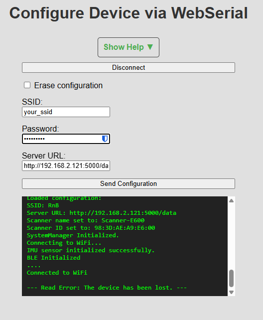

# Device Configuration Page

This guide explains how to use the "Configure Device" page to set the initial firmware parameters for a scanner using your web browser's WebSerial capability.

||
|-|
|Configure Device|

## Overview

The Device Configuration page provides a direct interface to a connected scanner's firmware. It allows you to set essential network settings so the device can connect to your local Wi-Fi and communicate with the central server. This method bypasses the need for hard-coding credentials into the firmware source code.

**Prerequisites:**
*   A physical scanner device connected to your computer via USB.
*   A modern web browser that supports WebSerial (e.g., Google Chrome, Microsoft Edge, Opera).

## Step-by-Step Guide

### 1. Connect to the Device

Before you can send any commands, you must establish a serial connection.

1.  **Click "Connect":** On the web page, click the "Connect" button. Your browser will open a pop-up window asking you to select a serial port. Choose the port that corresponds to your ESP32 device (e.g., `COM3` on Windows, `/dev/ttyUSB0` on Linux).

2.  **Put the Device into Configuration Mode:** To ensure the device is listening for a serial configuration, press  the **"BOOT" button** on the XIAO ESP32-C3 board.

3.  **Verify Connection:** Once connected, the button will change to "Disconnect," and the other UI elements will become active. You should see a "Serial port connected" message in the black serial output terminal at the bottom of the page.

### 2. Configure Settings

You have two main options when configuring a device:

#### A) Set Network Configuration

This is the standard operation. Fill in the following fields:

*   **SSID:** The name of the Wi-Fi network you want the device to connect to.
*   **Password:** The password for that Wi-Fi network.
*   **Server URL:** The full URL that the scanner will send its data to. This must include the protocol, IP address or hostname, port, and endpoint. For example: `http://192.168.1.100:5000/data`.

Once you have entered the details, click **"Send Configuration"**.

#### B) Erase Configuration

If you want to completely wipe all saved settings from the device's persistent memory, check the **"Erase configuration"** checkbox.

When this box is checked, the network fields will be disabled. Click **"Send Configuration"** to send the erase command. The device will clear its settings and restart.

### 3. Monitor the Output

The black terminal at the bottom of the page displays all serial communication between your browser and the device. This is extremely useful for debugging. You can see the commands you send and the confirmation messages or error logs that the device prints back. 