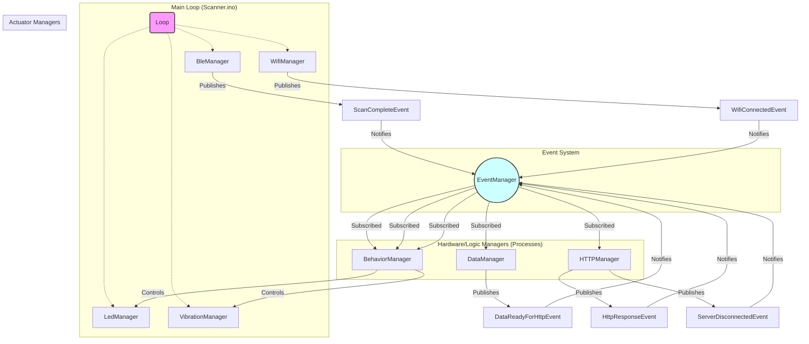
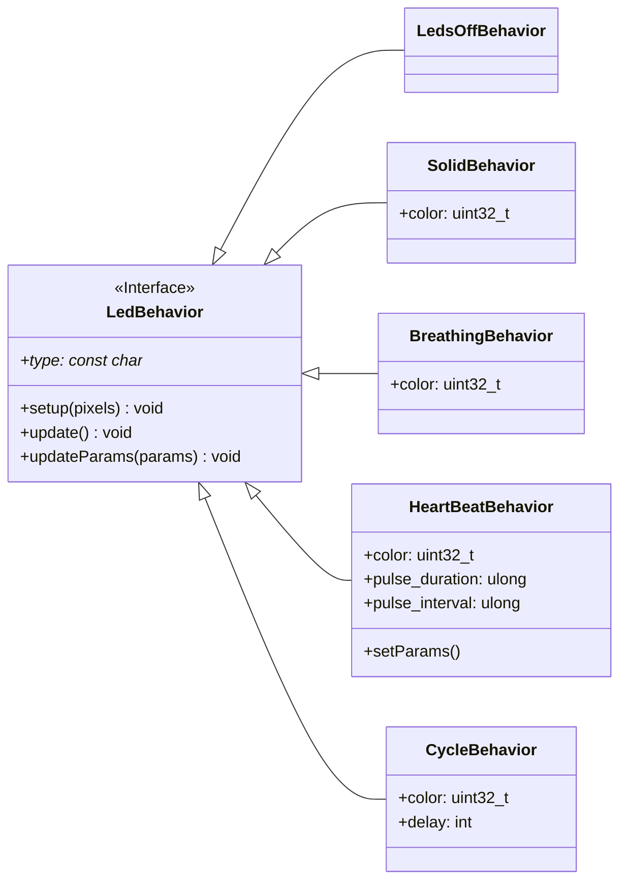

# Firmware Architecture

This document provides a high-level overview of the firmware architecture for the HitLoop Scanner device.

## Core Design Philosophy

The firmware is designed around two core principles:

1.  **Modularity:** Each major piece of functionality (e.g., managing Wi-Fi, handling BLE scans, controlling LEDs) is encapsulated in its own "Manager" class.
2.  **Decoupling:** Instead of Managers calling each other directly, they communicate using an **event-driven system**. A central `EventManager` is used to broadcast events, and managers subscribe to the events they care about. This reduces dependencies and makes the system easier to modify and test.

All managers inherit from a base `Process` class, which ensures they have a common `setup()` and `update()` interface that is called by the main `Scanner.ino` sketch.

## System Components and Data Flow

The diagram below illustrates the primary components of the system and how they interact. The `EventManager` is the central hub through which all communication flows.

### Data Flow Example: A Full Cycle

1.  `BleManager`'s timer fires, and it initiates a BLE scan.
2.  When the scan completes, `BleManager` publishes a `ScanCompleteEvent` containing the results.
3.  `DataManager`, which is subscribed to this event, receives it. It processes the raw scan data, combines it with IMU data, and formats it into a JSON payload.
4.  `DataManager` then publishes a `DataReadyForHttpEvent` containing the JSON payload.
5.  `HTTPManager` receives this event, opens a connection to the server, and POSTs the data.
6.  When the server responds, `HTTPManager` publishes an `HttpResponseEvent` with the server's payload (or a `ServerDisconnectedEvent` on failure).
7.  `BehaviorManager` receives the response event. It parses the payload for any behavior commands (`led_behavior`, `vibration_behavior`) or synchronization data (`wait_ms`).
8.  If there are behavior commands, `BehaviorManager` tells the appropriate manager (`LedManager` or `VibrationManager`) which behavior to use from its pool.
9.  The `LedManager` or `VibrationManager` then runs the `update()` loop for that behavior on its own, independent of the main loop, ensuring smooth animations.

## The Behavior Pattern

The firmware uses a "Behavior" pattern to define how the LEDs and vibration motor act. This makes it easy to add new animations or effects.

-   **Base Class:** A base class (`LedBehavior` or `VibrationBehavior`) defines a common interface with `setup()`, `update()`, and `updateParams()` methods.
-   **Concrete Classes:** Specific effects like `SolidBehavior`, `HeartBeatBehavior`, or `BurstVibrationBehavior` inherit from the base class and implement the logic for that effect.
-   **BehaviorManager:** This manager holds a "pool" of all available behavior objects. When it receives a command from the server, it looks up the requested behavior in its pool, updates its parameters (e.g., color, frequency), and tells the relevant `LedManager` or `VibrationManager` to use it.
-   **Actuator Managers:** The `LedManager` and `VibrationManager` are simple. They only hold a pointer to the *current* active behavior and are responsible for calling its `update()` method. The `LedManager` uses a `Ticker` to do this at a fixed interval, ensuring animations are smooth.

### LED Behavior Class Diagram

