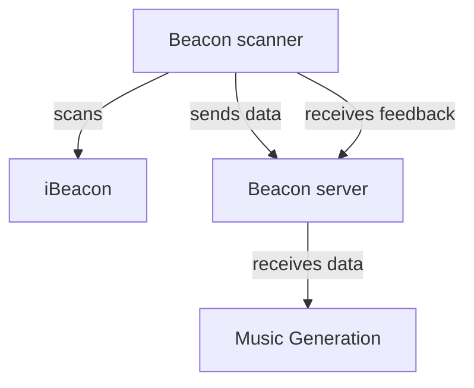

# Hitloop beacon controller

The Hitloop Beacon controller is a device that can be used to generate data from a crowd of people to enable them to control AI generated music tracks. The controllers provide:

- an iBeacon scanner to approximate the location of the users
- an accelerometer to detect the movement of the users
- an RGB LED to provide feedback
- a vibration motor to provide feedback

The controller sends the data to a server which then processes the data. Clients can retrieve the data from the server and use it to control the music generation or provide feedback to the controllers themselves.

## Documentation Sections

- [Hardware Details](hardware.md)
- [API Endpoints](api.md)
- [Simulation Page](simulation.md)

## Beacon Controller server

The Beacon Controller server is a Python Flask application. It receives data from the iBeacon and the accelerometer and sends it to the music generation service.

The server can be polled to get the current state of the controllers. Each controller can also ask the server for instructions to alter its behaviour based on it's current state and the state of the crowd.

This is the documentation for the HitLoop project.

## Table of Contents

- [Hardware](./hardware.md)
- [API Reference](./api.md)
- [Simulation](./simulation.md)
- [Firmware Flashing](./firmware.md)
- [Control Page](./control.md)
- [Device Configuration](./device_configuration.md)
- [Firmware Architecture](./firmware_architecture.md)
- [Webserver Architecture](./webserver_architecture.md)

---
`./hardware.md` - Details about the scanner and beacon controller hardware.
`./api.md` - Comprehensive reference for the server API endpoints.
`./simulation.md` - Guide to using the web-based device simulation.
`./firmware.md` - Instructions for flashing firmware to the hardware.
`./control.md` - Manual for the real-time device control interface.
`./device_configuration.md` - Guide for setting device credentials via WebSerial.
`./firmware_architecture.md` - An overview of the firmware's design and data flow.
`./webserver_architecture.md` - An overview of the webserver's structure and database schema.
---

## HitLoop
A system for interactive wearables.
