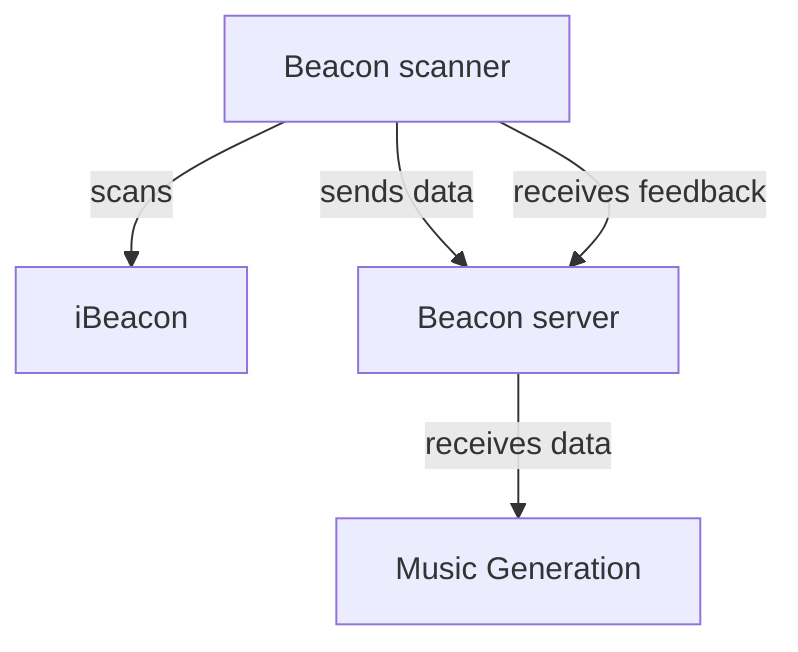
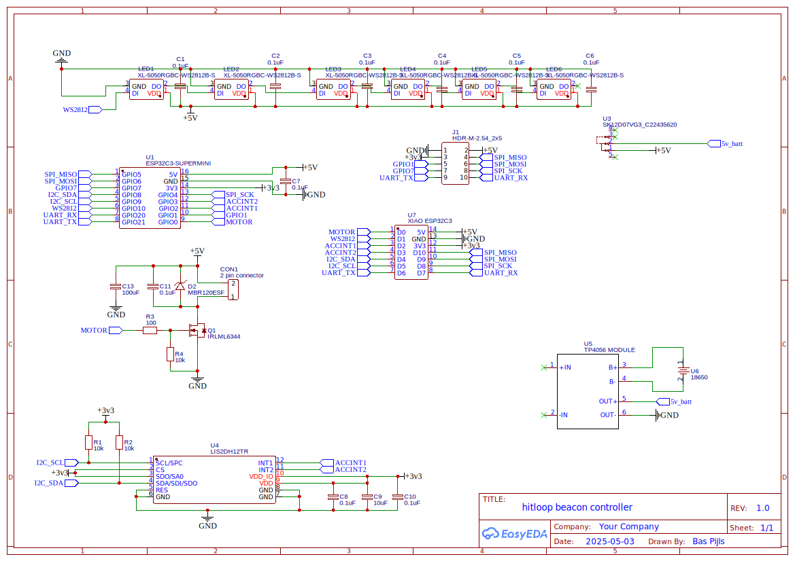
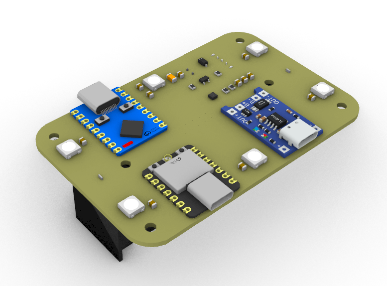
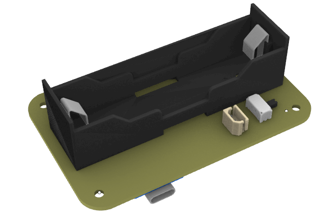

# Hitloop beacon controller

The Hitloop Beacon controller is a device that can be used to generate data from a crowd of people to enable them to control AI generated music tracks. The controllers provide:

- an iBeacon scanner to approximate the location of the users
- an accelerometer to detect the movement of the users
- an RGB LED to provide feedback
- a vibration motor to provide feedback

The controller sends the data to a server which then processes the data. Clients can retrieve the data from the server and use it to control the music generation or provide feedback to the controllers themselves.

## Hardware

### Beacon Controller

The controller is based on an ESP32 microcontroller.

Bill of materials:

- 1x XIAO ESP32 microcontroller
- 6x WS2812 RGB LEDs
- 1x LIS2DH12 accelerometer
- MOSFET based motor driver
- 1x 18650 battery holder
- 1x TP4056 charger module

||
|-|
|Schematic|

||pcb_bottom|
|-|-|
|PCB top| PCB Bottom|

### Pins

|Pin|Function|
|-|-|
|XIAO PIN| Function|
|D0| Motor driver|
|D1| WS2812b Data In|

The LIS2DH12 is connected to the XIAO via I2C.

### iBeacon

The iBeacon is based on an ESP32 microcontroller.

## Beacon Controller server

The Beacon Controller server is a Python Flask application. It receives data from the iBeacon and the accelerometer and sends it to the music generation service.

The server can be polled to get the current state of the controllers. Each controller can also ask the server for instructions to alter its behaviour based on it's current state and the state of the crowd.

