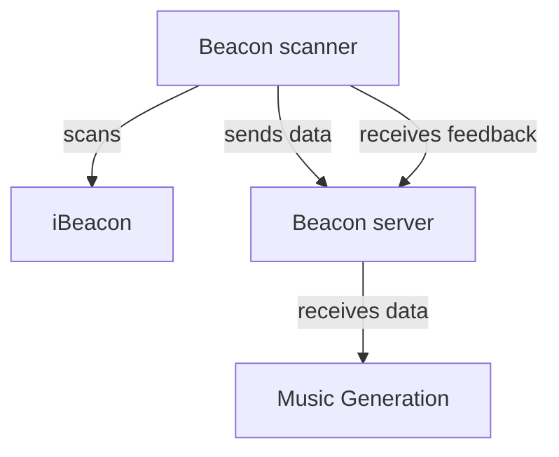

# Hitloop beacon controller

The Hitloop Beacon controller is a device that can be used to generate data from a crowd of people to enable them to control AI generated music tracks. The controllers provide:

- an iBeacon scanner to approximate the location of the users
- an accelerometer to detect the movement of the users
- an RGB LED to provide feedback
- a vibration motor to provide feedback

The controller sends the data to a server which then processes the data. Clients can retrieve the data from the server and use it to control the music generation or provide feedback to the controllers themselves.



## Hardware

### Beacon Controller

The controller is based on an ESP32 microcontroller.

Bill of materials:

- 1x XIAO ESP32 microcontroller
- 6x WS2812 RGB LEDs
- 1x LIS2DH12 accelerometer
- MOSFET based motor driver
- 1x 18650 battery holder
- 1x TP4056 charger module

||
|-|
|Schematic|

||pcb_bottom|
|-|-|
|PCB top| PCB Bottom|

### Pins

|XIAO PIN| Function|
|-|-|
|D0| Motor driver|
|D1| WS2812b Data In|

The LIS2DH12 is connected to the XIAO via I2C.

### iBeacon

The iBeacon is based on an ESP32 microcontroller.

## Beacon Controller server

The Beacon Controller server is a Python Flask application. It receives data from the iBeacon and the accelerometer and sends it to the music generation service.

The server can be polled to get the current state of the controllers. Each controller can also ask the server for instructions to alter its behaviour based on it's current state and the state of the crowd.

## API Endpoints

The server exposes the following endpoints:

### 1. `POST /data`

This endpoint is used by simulated or real beacon scanners to send their observed data to the server.

**Request Body:**

The request body must be a JSON object with the following structure:

- `Scanner name` (string, required): A unique identifier for the scanner sending the data.
- `movement` (float, optional): The total distance (e.g., in simulated pixels) the scanner has moved since its last report. Defaults to 0 if not provided.
- `beacons` (object, required): An object where each key is a unique beacon ID (e.g., `"beacon-NW"`) and the value is an object containing:
  - `RSSI` (integer, required): The Received Signal Strength Indicator for this scanner relative to this beacon.
  - `Beacon name` (string, required): A friendly name for the beacon (e.g., `"NW"`).

**Example Request Body:**

```json
{
    "Scanner name": "Scanner-A",
    "movement": 15.75,
    "beacons": {
        "beacon-NW": {
            "RSSI": -55,
            "Beacon name": "NW"
        },
        "beacon-SE": {
            "RSSI": -70,
            "Beacon name": "SE"
        }
    }
}
```

**Responses:**

- **200 OK:**
    Indicates that the data was successfully received and processed.
  - Body:
        ```json
        {
            "status": "success"
        }
        ```
- **400 Bad Request:**
    Indicates an error in the request data, such as missing `Scanner name`, or malformed `beacons` object, or missing `RSSI`/`Beacon name` for a beacon entry.
  - Body (example):
        ```json
        {
            "status": "error",
            "message": "Missing 'Scanner name' in payload"
        }
        ```

**Server-Side Logic:**

- The server uses the `Scanner name` as the primary key to store or update data in its internal `devices_data` dictionary.
- For each scanner, it stores:
  - `timestamp`: The UTC timestamp (ISO format) when the data was received.
  - `movement`: The reported movement value from the payload. If a scanner is new and no movement is reported, it defaults to 0.
  - `beacons_observed`: An object where each key is a `beacon_id` (e.g., `beacon-NW`). The value contains:
    - `rssi`: The received RSSI value.
    - `beacon_name`: The friendly name of the beacon.
    - `distance`: A string indicating the approximate distance ("close", "midrange", "far") calculated based on the RSSI.
      - "close": RSSI >= -65
      - "midrange": -80 < RSSI < -65
      - "far": RSSI <= -80
- If `RSSI` or `Beacon name` is missing for any beacon in the `beacons` object, a warning is logged on the server, and that specific beacon entry is skipped for that update.

### 2. `GET /`

This endpoint serves the main HTML dashboard page. This page displays a live table summarizing the status of all known scanners and the RSSI values to each beacon they have observed.

**Request Body:**

None.

**Responses:**

- **200 OK:**
  - Content-Type: `text/html`
  - Body: An HTML page. The page uses JavaScript to periodically fetch data from the `/devices` endpoint and dynamically update a table. The table typically shows:
    - Scanner Name
    - RSSI to Beacon 1 (e.g., NW)
    - RSSI to Beacon 2 (e.g., NE)
    - ... (for all detected beacons)
    - Movement (since last scanner report)
    - Last Update (timestamp for the scanner's last report)
  - If no scanner data has been received, it displays a message indicating so.

### 3. `GET /devices`

This endpoint returns a JSON object containing all current data for all known scanners.

**Request Body:**

None.

**Responses:**

- **200 OK:**
  - Content-Type: `application/json`
  - Body: A JSON object where each key is a `Scanner name`. The value for each scanner is an object containing:
    - `timestamp` (string): ISO format UTC timestamp of the last update from this scanner.
    - `movement` (float): The last reported movement value for this scanner.
    - `beacons_observed` (object): An object detailing each beacon observed by the scanner, with `rssi`, `beacon_name`, and calculated `distance`.
  **Example Response Body:**

    ```json
    {
        "Scanner-A": {
            "timestamp": "2023-10-27T10:30:00.123Z",
            "movement": 25.5,
            "beacons_observed": {
                "beacon-NW": {
                    "rssi": -60,
                    "beacon_name": "NW",
                    "distance": "close"
                }
            }
        },
        "Scanner-B": {
            "timestamp": "2023-10-27T10:30:05.456Z",
            "movement": 10.2,
            "beacons_observed": {
                "beacon-NW": {
                    "rssi": -70,
                    "beacon_name": "NW",
                    "distance": "midrange"
                },
                "beacon-SE": {
                    "rssi": -85,
                    "beacon_name": "SE",
                    "distance": "far"
                }
            }
        }
    }
    ```

### 4. `GET /reset_devices`

This endpoint clears all stored scanner data on the server. This is useful for resetting the simulation or data collection.

**Request Body:**

None.

**Responses:**

- **200 OK:**
  - Content-Type: `application/json`
  - Body:

    ```json
    {
        "status": "success",
        "message": "All device data cleared."
    }
    ```

## Simulation Page (`/simulation`)

The server also provides an interactive p5.js simulation to generate test data.

### `GET /simulation`

Serves an HTML page with a p5.js canvas that simulates multiple scanners and beacons.

||
|-|
|Simulation screenshot|

**Page Features:**

- **Visualization**:
  - Beacons are displayed as red circles in fixed positions (NW, NE, SW, SE corners).
  - Scanners are displayed as blue squares that move randomly and bounce off canvas edges.
  - Live RSSI values from each scanner to each beacon are displayed as text next to the scanner.
  - Semi-transparent circles are drawn around each beacon, with radii representing the distance to each scanner.
- **Data Generation**: Each simulated scanner periodically calculates its distance to all beacons, converts this to a simulated RSSI value, and tracks its own movement. This data is then POSTed to the `/data` endpoint.
- **Interactivity**:
  - **Click-to-Move**: Clicking on the canvas moves the first scanner (`Scanner-A`) to the mouse position.

**UI Controls Panel:**

A panel next to (or above) the canvas provides sliders to dynamically control simulation parameters:

- **Number of Scanners**:
  - Range: 1 to 50 (configurable).
  - Adjusting this slider updates the number of simulated scanners.
  - When the value is changed (slider released), it triggers a call to the `/reset_devices` API endpoint to clear server-side data before repopulating with the new number of scanners.
- **Scanner Max Speed**:
  - Controls the maximum speed at which scanners can move.
  - Updates existing scanners in real-time.
- **Velocity Change Magnitude**:
  - Controls how erratically the scanners change their direction and speed each frame.
  - Updates existing scanners in real-time.

This simulation page is useful for testing the server endpoints and observing the data flow to the main dashboard page (`/`).
