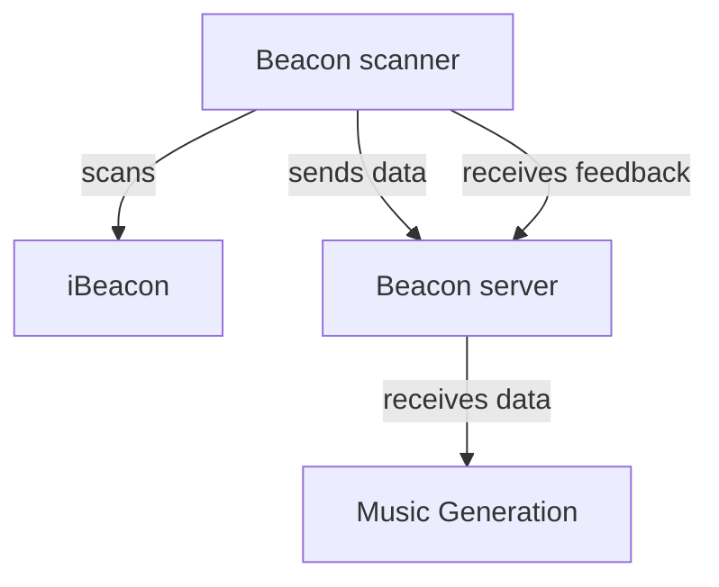

# Hitloop beacon controller

The Hitloop Beacon controller is a device that can be used to generate data from a crowd of people to enable them to control AI generated music tracks. The controllers provide:

- an iBeacon scanner to approximate the location of the users
- an accelerometer to detect the movement of the users
- an RGB LED to provide feedback
- a vibration motor to provide feedback

The controller sends the data to a server which then processes the data. Clients can retrieve the data from the server and use it to control the music generation or provide feedback to the controllers themselves.



## Hardware

### Beacon Controller

The controller is based on an ESP32 microcontroller.

Bill of materials:

- 1x XIAO ESP32 microcontroller
- 6x WS2812 RGB LEDs
- 1x LIS2DH12 accelerometer
- MOSFET based motor driver
- 1x 18650 battery holder
- 1x TP4056 charger module

||
|-|
|Schematic|

||pcb_bottom|
|-|-|
|PCB top| PCB Bottom|

### Pins

|XIAO PIN| Function|
|-|-|
|D0| Motor driver|
|D1| WS2812b Data In|

The LIS2DH12 is connected to the XIAO via I2C.

### iBeacon

The iBeacon is based on an ESP32 microcontroller.

## Beacon Controller server

The Beacon Controller server is a Python Flask application. It receives data from the iBeacon and the accelerometer and sends it to the music generation service.

The server can be polled to get the current state of the controllers. Each controller can also ask the server for instructions to alter its behaviour based on it's current state and the state of the crowd.

## API Endpoints

The server exposes the following endpoints:

### 1. `POST /data`

This endpoint is used to send data from the beacon scanners to the server. The server expects a JSON payload.

**Request Body:**

The request body should be a JSON object. This object can optionally contain a `Scanner name` field. If present, this field will be removed from the data before processing. The remaining keys in the JSON object are treated as `device_id`s. Each `device_id` should map to an object containing the following fields:

- `RSSI` (integer, required): The Received Signal Strength Indicator for the detected device.
- `Beacon name` (string, required): The name of the beacon that detected the device.

**Example Request Body:**

```json
{
    "Scanner name": "OptionalScannerID",
    "Device_ABC": {
        "RSSI": -60,
        "Beacon name": "Beacon_1"
    },
    "Device_XYZ": {
        "RSSI": -75,
        "Beacon name": "Beacon_2"
    }
}
```

**Responses:**

- **200 OK:**
    Indicates that the data was successfully received and processed.
  - Body:

        ```json
        {
            "status": "success"
        }
        ```

* **400 Bad Request:**
    Indicates that there was an error in the request data, usually missing `RSSI` or `Beacon name` for one or more devices.
  - Body:

        ```json
        {
            "status": "error",
            "message": "Missing data for [device_id]"
        }
        ```

**Server-Side Logic:**

- Upon receiving data, the server iterates through each device entry in the JSON payload.
- For each device, it stores or updates the following information in its internal `devices_data` dictionary:
  - `rssi`: The received RSSI value.
  - `beacon_name`: The name of the beacon.
  - `timestamp`: The UTC timestamp when the data was received (ISO format).
  - `distance`: A string indicating the approximate distance ("close", "midrange", "far") calculated based on the RSSI.
    - "close": RSSI >= -65
    - "midrange": -80 < RSSI < -65
    - "far": RSSI <= -80

### 2. `GET /`

This endpoint serves an HTML page that displays the last known data for all detected devices. The page automatically refreshes every 5 seconds.

**Request Body:**

None.

**Responses:**

- **200 OK:**
  - Content-Type: `text/html`
  - Body: An HTML page displaying a table with the following columns for each device:
    - Device ID
    - Beacon name
    - RSSI
    - Distance
    - Last Updated (UTC timestamp)
  - If no data has been received yet, it displays "No device data received yet."
