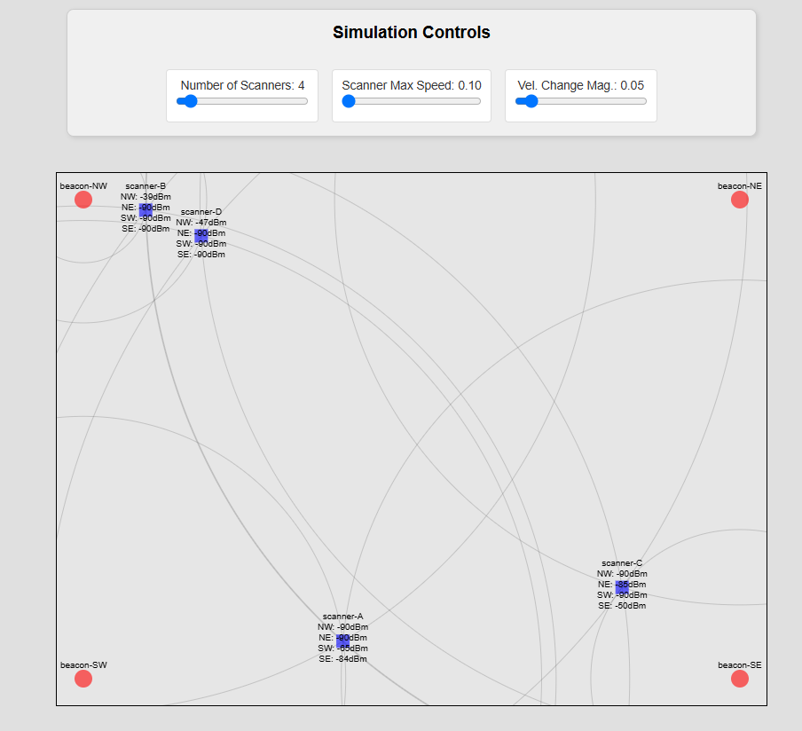

## Simulation Page (`/simulation`)

The server also provides an interactive p5.js simulation to generate test data.

### `GET /simulation`

Serves an HTML page with a p5.js canvas that simulates multiple scanners and beacons.

||
|-|
|Simulation screenshot|

**Page Features:**

- **Visualization**:
  - Beacons are displayed as red circles in fixed positions (NW, NE, SW, SE corners).
  - Scanners are displayed as blue squares that move randomly and bounce off canvas edges.
  - Live RSSI values from each scanner to each beacon are displayed as text next to the scanner.
  - Semi-transparent circles are drawn around each beacon, with radii representing the distance to each scanner.
- **Data Generation**: Each simulated scanner periodically calculates its distance to all beacons, converts this to a simulated RSSI value, and tracks its own movement. This data is then POSTed to the `/data` endpoint.
- **Interactivity**:
  - **Click-to-Move**: Clicking on the canvas moves the first scanner (`Scanner-A`) to the mouse position.

**UI Controls Panel:**

A panel next to (or above) the canvas provides sliders to dynamically control simulation parameters:

- **Number of Scanners**:
  - Range: 1 to 50 (configurable).
  - Adjusting this slider updates the number of simulated scanners.
  - When the value is changed (slider released), it triggers a call to the `/reset_devices` API endpoint to clear server-side data before repopulating with the new number of scanners.
- **Scanner Max Speed**:
  - Controls the maximum speed at which scanners can move.
  - Updates existing scanners in real-time.
- **Velocity Change Magnitude**:
  - Controls how erratically the scanners change their direction and speed each frame.
  - Updates existing scanners in real-time.

This simulation page is useful for testing the server endpoints and observing the data flow to the main dashboard page (`/`). 