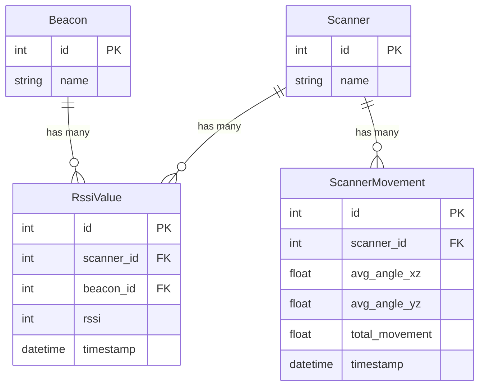

# Webserver Architecture

This document provides a high-level overview of the webserver architecture, focusing on the Flask application structure and the database schema.

## Flask Application Structure

The webserver is a standard Flask application with a modular structure, organized as follows:

-   `run.py`: The main entry point to start the Flask development server.
-   `config.py`: Contains basic configuration for the application, such as secret keys and database settings.
-   `app/`: This directory contains the core application logic, structured as a Flask blueprint.
    -   `__init__.py`: Initializes the Flask application, configures the database (Flask-SQLAlchemy), and registers the main blueprint.
    -   `routes.py`: Defines all the API endpoints and the logic for handling requests and serving HTML pages.
    -   `models.py`: Defines the database schema using SQLAlchemy ORM classes.
    -   `static/`: Contains all static assets for the frontend, such as CSS, JavaScript, and images.
    -   `templates/`: Contains all Jinja2 HTML templates for the web pages (`index.html`, `control.html`, etc.).

## Database Schema (ERD)

The application uses a relational database (managed by Flask-SQLAlchemy) to persist historical data from the scanners. The schema is designed to track scanners, the beacons they detect, and their movement over time.

### Table / Model Explanations

#### `Scanner`
This table represents the physical scanner devices.

-   `id`: A unique integer primary key.
-   `name`: A unique string identifier for the scanner, typically its MAC address (e.g., `"64:E8:33:84:CB:84"`). This is the main identifier used throughout the system.

#### `Beacon`
This table represents the BLE beacon devices that the scanners are detecting.

-   `id`: A unique integer primary key.
-   `name`: A unique string identifier for the beacon (e.g., `"Beacon-A"`).

#### `RssiValue`
This is a **junction table** that records a single beacon detection by a single scanner at a specific point in time. It is the core data table of the system.

-   `id`: A unique integer primary key.
-   `scanner_id`: A foreign key linking to the `Scanner` that made the observation.
-   `beacon_id`: A foreign key linking to the `Beacon` that was observed.
-   `rssi`: The Received Signal Strength Indicator measured during the observation.
-   `timestamp`: The UTC timestamp automatically recorded when the observation was saved.

#### `ScannerMovement`
This table logs the movement data captured by a scanner's Inertial Measurement Unit (IMU) during a scan interval.

-   `id`: A unique integer primary key.
-   `scanner_id`: A foreign key linking to the `Scanner` that recorded the movement.
-   `avg_angle_xz` / `avg_angle_yz`: The average angle of the device on two planes during the interval.
-   `total_movement`: A metric representing the total amount of movement during the interval.
-   `timestamp`: The UTC timestamp automatically recorded when the movement data was saved. 